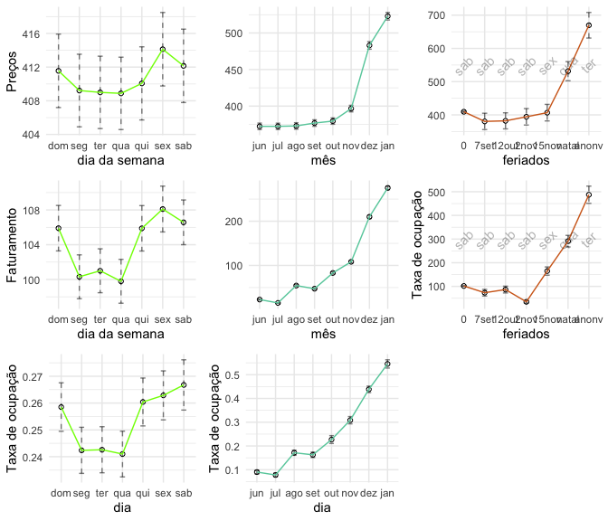
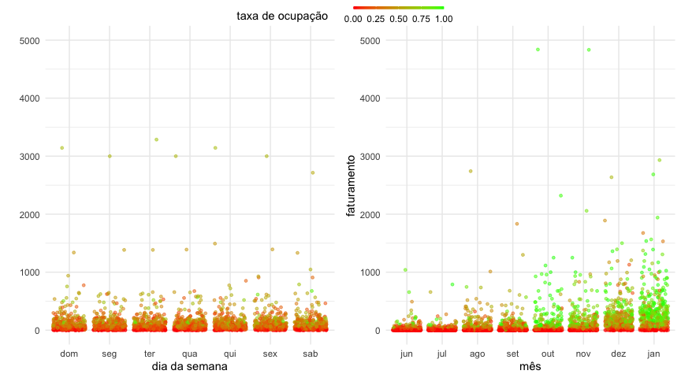
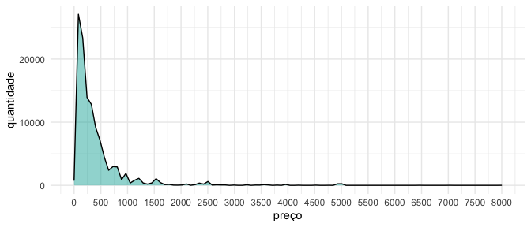

Análise de dados imobiliários para processo seletivo
================
Pedro Blaya Luz
\| novembro de 2020

-   [Parte 1](#parte-1)
    -   [Excel](#excel)
    -   [Python](#python)
-   [Parte 2](#parte-2)
    -   [Qual ID teve o maior
        faturamento?](#qual-id-teve-o-maior-faturamento)
    -   [Qual ID teve o menor
        faturamento?](#qual-id-teve-o-menor-faturamento)
    -   [Qual a média de faturamento das
        IDs?](#qual-a-média-de-faturamento-das-ids)
    -   [Qual mês apresentou o maior (e o menor) faturamento
        médio?](#qual-mês-apresentou-o-maior-e-o-menor-faturamento-médio)
    -   [Qual a média de taxa de ocupação para Janeiro? E para
        Outubro?](#qual-a-média-de-taxa-de-ocupação-para-janeiro-e-para-outubro)
-   [Extras](#extras)
    -   [Preço, faturamento e taxa de
        ocupação](#preço-faturamento-e-taxa-de-ocupação)
    -   [Distribuição dos preços](#distribuição-dos-preços)
    -   [Modelo linear](#modelo-linear)
-   [Parte 3](#parte-3)

## Parte 1

[prices-info.xlsx](https://github.com/pedroblayaluz/imoveis/blob/master/data/price-info.xlsx)
é um arquivo com precos de diárias de imóveis ao longo de várias datas.
As células que estão em verde indicam momentos em que o imóvel foi
alugado. É preciso criar uma nova planilha com o faturamento mensal por
imóvel a partir deste arquivo. Desenvolvi uma solução para o problema
utilizando o **Excel** e outra utilizando **Python**.

### Excel

Para resolver o problema dentro do Excel criei uma função com o nome
`sumGreens()` que soma somente os valores das células verdes e apliquei
ela para cada mês. A planilha final está dentro do arquivo
[parte1.xlsx](https://github.com/pedroblayaluz/imoveis/blob/master/data/parte1.xlsx)
com o nome de *Faturamento mensal* e na planilha *Sheet1* está a solução
do problema com a função aplicada à planilha original.

### Python

Também desenvolvi uma solução em Python mais flexível, para depois poder
acessar os dados de forma mais fácil. O script
[parte1.py](https://github.com/pedroblayaluz/imoveis/blob/master/code/parte1.py)
lê as cores e os números da planilha *Sheet 1* em
[prices-info.xlsx](https://github.com/pedroblayaluz/imoveis/blob/master/data/price-info.xlsx)
e cria duas novas planilhas a partir dessas informações:

-   `faturamento_mensal` é a planilha criada para a resolução do
    problema, contendo o faturamento mensal total por ID.

``` python
faturamento_mensal.head()
```

    ##           jun     jul      ago      set       out       nov       dez       jan
    ## id                                                                             
    ## 20927  6705.0     0.0   4974.0   9723.0    8373.0    5184.0    7644.0    3861.0
    ## 26364  1320.0    84.0     84.0      0.0      84.0       0.0    1010.0       0.0
    ## 37265  1639.0  1537.0    900.0    297.0       0.0    1386.0    2692.0    3720.0
    ## 82094     0.0     0.0      0.0      0.0       0.0       0.0    1125.0    1935.0
    ## 83547     0.0     0.0  85000.0  55000.0  150000.0  145000.0  155000.0  155000.0

-   `dados_totais` contém toda a informação presente no arquivo
    original, mas agora organizados de forma *tidy*, facilitando muito a
    análise dos dados depois.

``` python
dados_totais.head()
```

    ##       id       data       cor   preco  ocupado  faturamento  mes
    ## 0  20927 2019-06-01  FF993300   381.0        0          0.0    6
    ## 1  26364 2019-06-01  FF33CCCC    60.0        1         60.0    6
    ## 2  37265 2019-06-01  FF993300   149.0        0          0.0    6
    ## 3  82094 2019-06-01  FF993300    60.0        0          0.0    6
    ## 4  83547 2019-06-01  FF969696  5000.0        0          0.0    6

## Parte 2

O script completo da Parte 2 está disponível em
[parte2.py](https://github.com/pedroblayaluz/imoveis/blob/master/code/parte2.py)

### Qual ID teve o maior faturamento?

ID 83547, com um faturamento total de R$745.000

``` python
df_faturamento_total = dados_totais.groupby(['id'])\
                                   .faturamento.sum()\
                                   .reset_index(name='faturamento_total')\
                                   .sort_values(by='faturamento_total',ascending=False)
df_faturamento_total.iloc[0:1]
```

    ##       id  faturamento_total
    ## 4  83547           745000.0

### Qual ID teve o menor faturamento?

As seguintes IDs tiveram um faturamento igual a zero:

``` python
faturamento_zero = df_faturamento_total['faturamento_total']==0
df_faturamento_total[faturamento_zero][['id']].astype(str).id.str.cat(sep=' | ')
```

    ## '10363087 | 982402 | 16294535 | 10366668 | 4293449 | 16298244 | 10367722 | 942411 | 16323237 | 16331050 | 2223263 | 16333503 | 96939 | 16333649 | 748321 | 16849257 | 16851036 | 2103758 | 2083416 | 291437 | 4511690 | 4330674 | 4587329 | 16897092 | 32982749 | 693457 | 32991670 | 130736 | 122504 | 32994399 | 31242632 | 1564315 | 16251833'

### Qual a média de faturamento das IDs?

A planilha completa com o faturamento médio por mês e dia para cada ID
pode ser acessada no objeto `id_medias`:

``` python
mensal = dados_totais.groupby(["id",'mes'])\
                      .faturamento.sum().reset_index()\
                      .groupby(['id'])['faturamento'].mean()\
                      .reset_index(name='faturamento mensal')
diario = dados_totais.groupby(["id"])\
                      .faturamento.mean()\
                      .reset_index(name='faturamento diário')
id_medias = pd.concat([mensal,diario.iloc[:,1:]],axis=1)
id_medias
```

    ##            id  faturamento mensal  faturamento diário
    ## 0       20927            5808.000          189.648980
    ## 1       26364             322.750           10.538776
    ## 2       37265            1521.375           49.677551
    ## 3       82094             382.500           12.489796
    ## 4       83547           93125.000         3040.816327
    ## ..        ...                 ...                 ...
    ## 494  33090580             422.500           13.795918
    ## 495  33092756              11.250            0.367347
    ## 496  33093306            1969.625           64.314286
    ## 497  33093565            1307.250           42.685714
    ## 498  33093723            1971.125           64.363265
    ## 
    ## [499 rows x 3 columns]

### Qual mês apresentou o maior (e o menor) faturamento médio?

Janeiro apresentou o maior faturamento médio (R$ 8470) e julho
apresentou o menor (R$ 452)

``` python
dados_totais.groupby(["id",'mes'])\
                      .faturamento.sum().reset_index()\
                      .groupby(['mes'])['faturamento'].mean()\
                      .reset_index(name='faturamento medio')
```

    ##    mes  faturamento medio
    ## 0    1        8469.995992
    ## 1    6         648.010020
    ## 2    7         451.933868
    ## 3    8        1612.024048
    ## 4    9        1360.046092
    ## 5   10        2470.863727
    ## 6   11        3154.949900
    ## 7   12        6387.961924

### Qual a média de taxa de ocupação para Janeiro? E para Outubro?

A taxa de ocupacão média para Janeiro é de \~55% e para Outubro de
\~23%.

``` python
taxa_ocupacao = dados_totais.groupby(['id', 'mes'])[['ocupado']]\
                            .agg(['sum','count']).reset_index()
taxa_ocupacao.columns = taxa_ocupacao.columns.map(''.join)
taxa_ocupacao['taxa'] = taxa_ocupacao.ocupadosum / taxa_ocupacao.ocupadocount
ocupacao_media = taxa_ocupacao.groupby('mes')['taxa']\
                              .mean().reset_index()
ocupacao_media[(ocupacao_media.mes == 1) | (ocupacao_media.mes == 10)]
```

    ##    mes      taxa
    ## 0    1  0.545284
    ## 5   10  0.226970

## Extras

Além das informações solicitadas também fiz algumas análises extras em
**R** para visualizar melhor as variações presentes nos dados. O código
utilizado para fazer esses gráficos está disponível em
[extras.r](https://github.com/pedroblayaluz/imoveis/blob/master/code/extras.r).

### Preço, faturamento e taxa de ocupação

Em `graficos_por_variavel` podemos ver a variação dos **preços**,
**faturamento** e **taxa de ocupação** entre diferentes dias da
**semana**, **meses** e **feriados**:

``` r
graficos_por_variavel
```



Aqui fica claro que os preços e a taxa de ocupação **aumentam muito a
medida em que nos aproximamos dos meses de verão**, e com eles o
faturamento. Também é possível ver que existe uma variação semanal nos
preços e na ocupacão, **aumentando no final de semana** a partir de
quinta-feira e caindo na segunda-feira. Os feriados nos meses mais
quentes tiveram maiores preços e faturamento. O **faturamento no ano
novo** se destaca por ter sido muito superior ao faturamento médio de
dezembro ou janeiro.

Observando as médias e os erros padrão podemos ver que a variação
semanal é muito menor do que a variação mensal, ou seja: **o mês tem uma
influência muito maior nos preços e na taxa de ocupação do que o dia da
semana**. Em `graficos_multivariaveis` estes mesmos dados são
apresentados de forma conjunta e numa mesma escala, facilitando a
comparação:

``` r
graficos_multivariaveis
```



### Distribuição dos preços

Além disso, podemos também aproveitar para entender melhor a
distribuição dos preços dos imóveis. Podemos ver que eles têm uma
distribuição mais próxima da logarítmica, com **uma grande quantidade**
de imóveis com preços **entre R$100-1000**, e **alguns imóveis** com
valores **muito maiores** do que esses:

``` r
#Distribuicao dos precos
dados_totais %>% ggplot(aes(x=preco)) +
  geom_area(aes(y = ..count..), stat = "bin", alpha=0.5,
            bins=100,color='black',fill='lightseagreen') +
  scale_x_continuous(n.breaks=20) + theme_minimal() + labs(y='quantidade',x='preço')
```



### Modelo linear

Para ter mais confiança nesses resultados, podemos ajustar um modelo
linear a estes dados, para saber quais variáveis temporais têm mais
influência sobre os preços dos imóveis:

``` r
#Removendo NAs e 0s
dados_modelo <- dados_totais %>% filter(!preco %in% NA) %>%
  filter(!preco %in% 0)
#Resultados do modelo
summary(lm(log(preco) ~ mes + feriado + dia, data=dados_modelo))
```

    ## 
    ## Call:
    ## lm(formula = log(preco) ~ mes + feriado + dia, data = dados_modelo)
    ## 
    ## Residuals:
    ##     Min      1Q  Median      3Q     Max 
    ## -2.2695 -0.6572 -0.0190  0.5495  3.2711 
    ## 
    ## Coefficients:
    ##               Estimate Std. Error t value Pr(>|t|)    
    ## (Intercept)   5.434542   0.009943 546.572  < 2e-16 ***
    ## mesjul        0.004036   0.010726   0.376 0.706675    
    ## mesago        0.008451   0.010740   0.787 0.431354    
    ## messet        0.025071   0.010909   2.298 0.021549 *  
    ## mesout        0.041091   0.010807   3.802 0.000143 ***
    ## mesnov        0.088291   0.010939   8.071 7.01e-16 ***
    ## mesdez        0.288260   0.010821  26.639  < 2e-16 ***
    ## mesjan        0.425838   0.010620  40.097  < 2e-16 ***
    ## feriado7set   0.001999   0.043100   0.046 0.963005    
    ## feriado12out -0.004085   0.042907  -0.095 0.924148    
    ## feriado2nov  -0.022706   0.042847  -0.530 0.596152    
    ## feriado15nov  0.040304   0.042734   0.943 0.345612    
    ## feriadonatal  0.148410   0.042341   3.505 0.000457 ***
    ## feriadoanonv  0.368180   0.042299   8.704  < 2e-16 ***
    ## diaseg       -0.003597   0.009933  -0.362 0.717283    
    ## diater       -0.014810   0.010014  -1.479 0.139139    
    ## diaqua       -0.012950   0.010024  -1.292 0.196395    
    ## diaqui       -0.007359   0.009941  -0.740 0.459174    
    ## diasex        0.001976   0.010012   0.197 0.843518    
    ## diasab        0.010192   0.010175   1.002 0.316482    
    ## ---
    ## Signif. codes:  0 '***' 0.001 '**' 0.01 '*' 0.05 '.' 0.1 ' ' 1
    ## 
    ## Residual standard error: 0.91 on 117635 degrees of freedom
    ## Multiple R-squared:  0.02837,    Adjusted R-squared:  0.02821 
    ## F-statistic: 180.8 on 19 and 117635 DF,  p-value: < 2.2e-16

Os resultados do modelo mostram que **mês** foi de longe a variável com
**maior influência** sobre os preços dos imóveis, com o efeito
aumentando significativamente a cada mês de setembro até janeiro.  
Além disso, também podemos ver que as datas do **natal** e
principalmente **ano novo** também **influenciaram o aumento** dos
preços das diárias.  
Entretanto, o **R-quadrado** baixo, de **\~0.3%** mostra que o modelo
ainda **explica muito pouco da variação dos preços das diárias**. Isto
pode estar acontecendo porque a maior parte da explicação por trás dos
valores das diárias deve estar nas **características dos imóveis**. A
diferença entre os dias da semana não foi estatisticamente
significativa, mas possivelmente essa diferença apareceria ao incluirmos
mais informações sobre as características dos imóveis no modelo.

## Parte 3

Algumas das conclusões que podemos tirar a partir desses dados:

-   O **mês** influencia muito o valor da diária, a taxa de ocupação e
    consequentemente o faturamento.

-   Apesar de muito menor, o **dia da semana** também têm uma influência
    sobre esses valores.

-   **Natal** e principalmente o **Ano novo** influenciam os preços das
    diárias.

Ainda assim, o aspecto temporal corresponde à uma parte relativamente
pequena da variação nos preços dos imóves, e provavelmente são as
**características dos imóveis** que mais influenciam no preço da diária.
Então, para que seja possível fazer a precificação dinâmica ao longo do
tempo, é essencial ter uma boa **base de dados com características dos
imóveis**.  
Tendo em mãos uma base de dados com as **características dos imóveis**,
a **data** e os **preços** eu testaria diferentes abordagens de
**Machine Learning** para tentar prever os preços das diárias. Seria
possível realizar isso utilizando técnicas de **regressão linear**,
**random forests** ou até **redes neurais**.
